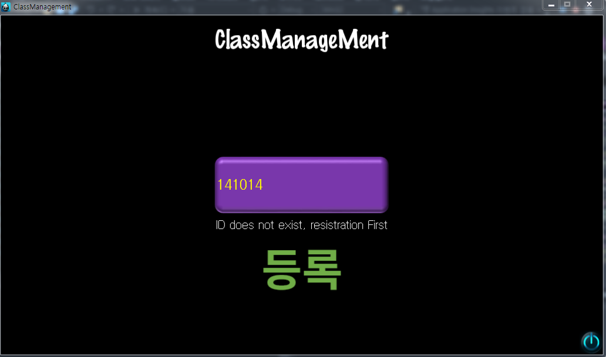
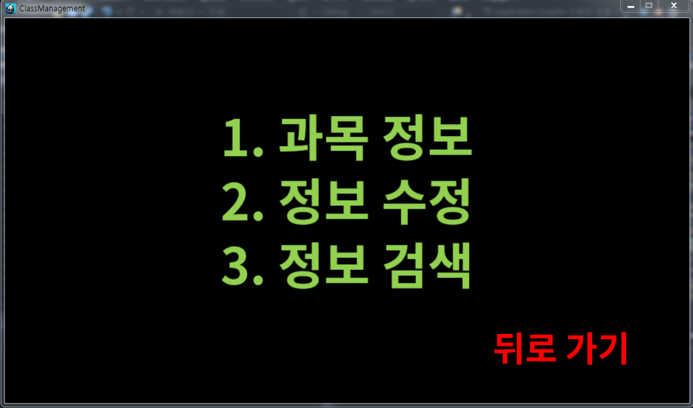
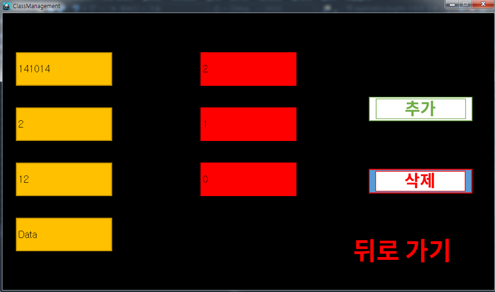

# ClassManagement

**사용 언어** : C++, MySQL

**사용 프레임워크** : Cocos2d-x

**설명** 
- 수강 이력 관리 시스템
- 수강한 과목에 대해서 어떤 내용을 몇 주차에 공부했는지 알 수 있음
- 배운 내용에 대해서 검색 가능
- 새롭게 과목 추가하거나 과목 삭제 가능
- 주차별 배운 내용 추가 가능

**역할** : DB, Cocos2d-x 프로그래밍

**개발 인원** : 1명

[**저장소 주소**](https://github.com/abiles/DBProject2014)

## **ScreenShots**
----
 
 
 

