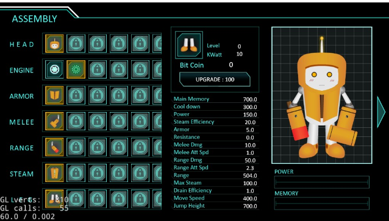
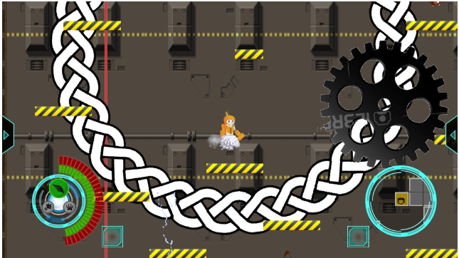

# Robotopia

**사용 언어** : C++

**사용 프레임워크** : Cocos2d-x

**설명** : 록맨 스타일의 1인 액션게임

**역할** : 장비 선택 Scene, 미사일 관련 내용, 이펙트, 카메라

**개발 인원** : 4명

**자세한 설명** : [최종보고서](https://github.com/jwvg0425/ProjectArthas/wiki/%EB%B3%B4%EA%B3%A0%EC%84%9C)

## **ScreenShots**
----
 
 

